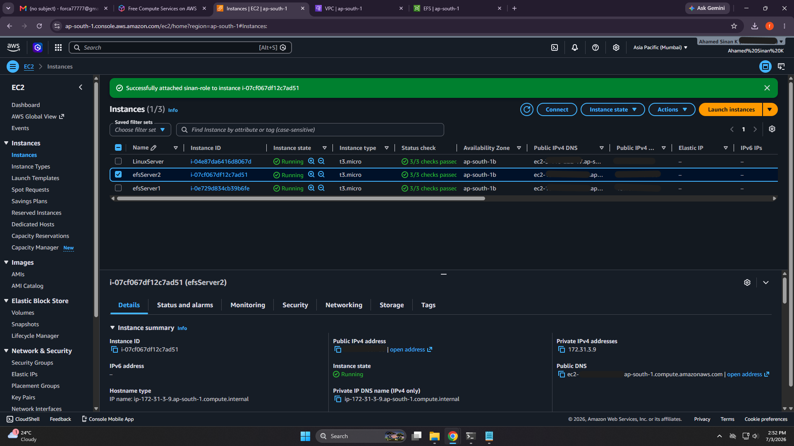
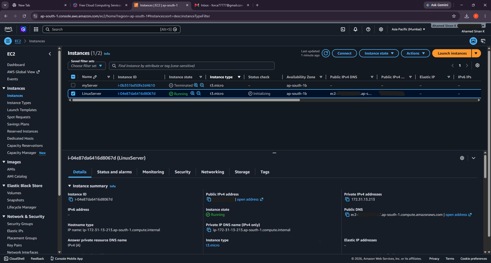
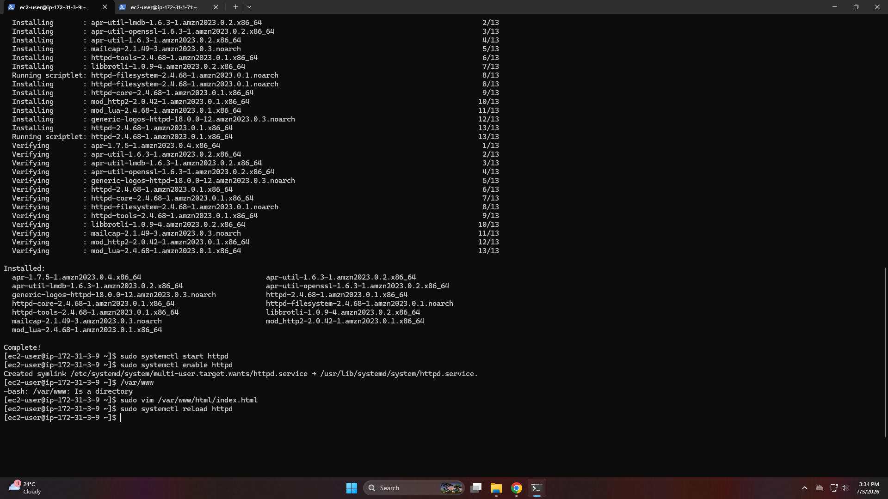
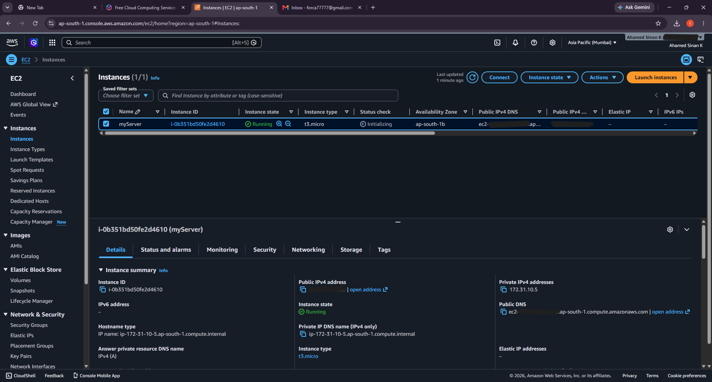
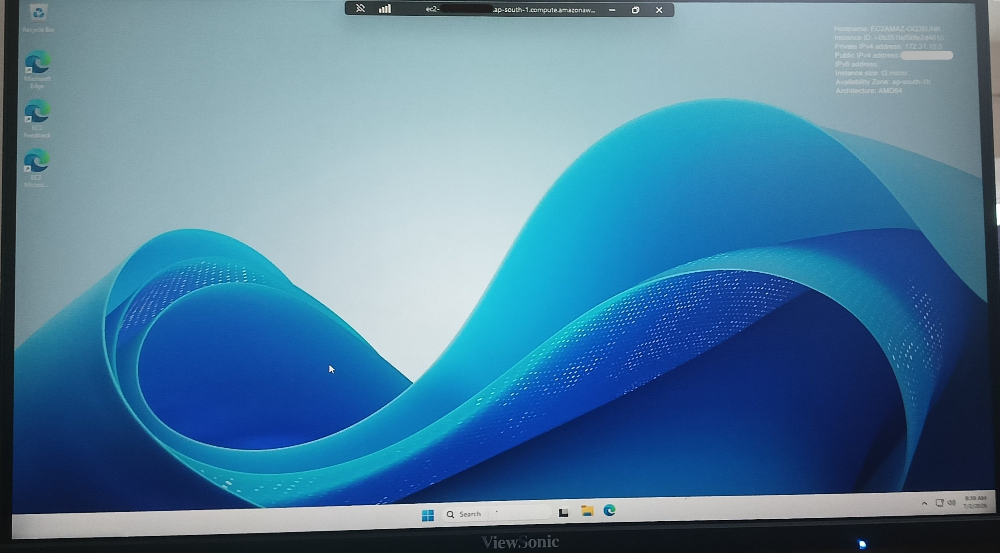
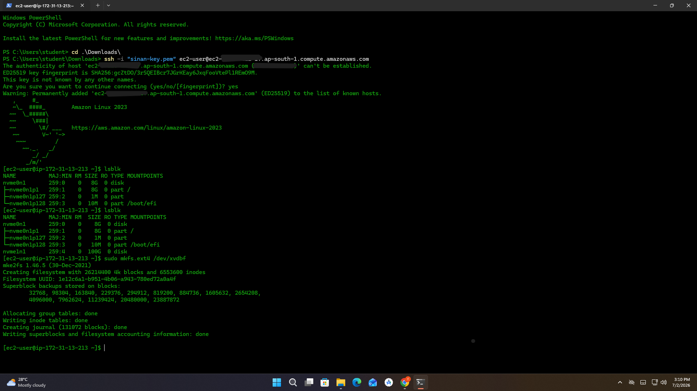
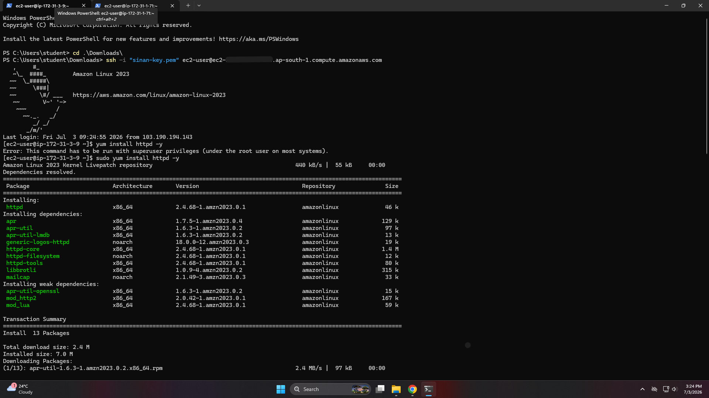
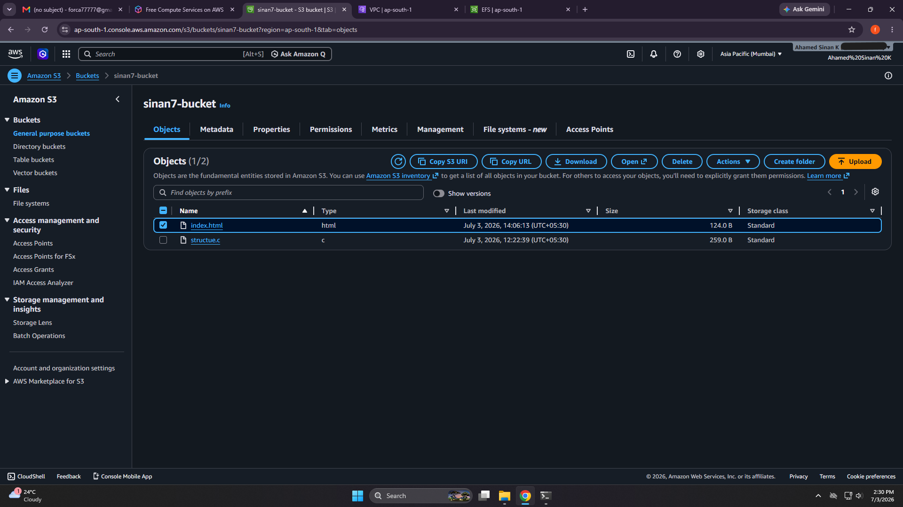
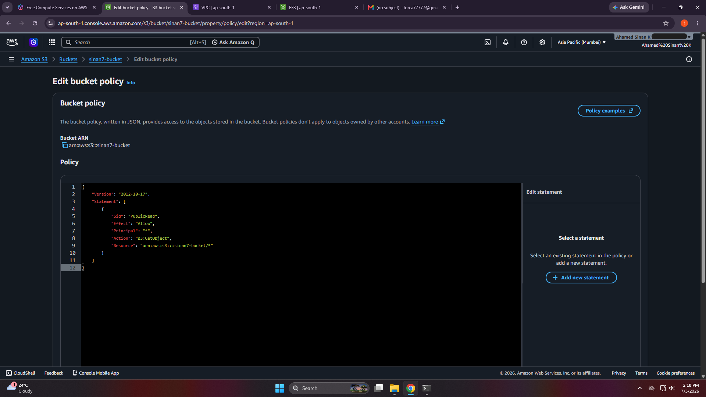
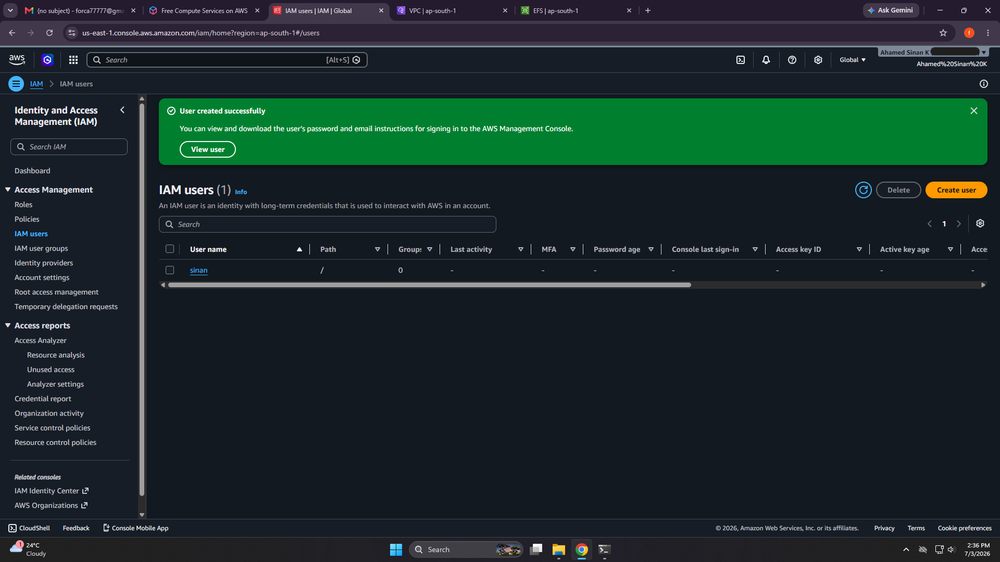

# AWS & Cloud Architecture Deep Dive
**Date:** July 4, 2026

**Topic:** AWS Infrastructure, Enterprise Cloud Strategies, and Global Networking

Today, I took a massive leap from deploying basic servers to understanding how the global internet and enterprise cloud architecture actually work. Here is a complete breakdown of everything I learned from my 2 days hands-on aws workshop and self-taught

---

## 1️⃣ AWS Workshop Core Deployments (The Foundation)
Over the course of two days, I successfully built a multi-server, internet-facing architecture. 

###  Visual Infrastructure (Lab Execution)
*Here are the deployment screenshots from my AWS Management Console and Linux terminal before breaking down the concepts:*

**1. Compute Core: EC2 Provisioning**
- EC2 Dashboard displaying running nodes

- Linux Server Instance Detail

- Web Host Instance Details

- Windows Server Instance Console

- Windows Virtual Machine RDP Desktop

**2. Storage Engineering: Formatting EBS via SSH**
- Git Bash SSH session executing lsblk and mkfs.ext4

**3. Web Deployment: Installing Apache**
- Linux Terminal running yum install httpd

**4. Object Storage: S3 & Cloud Hosting**
- S3 Bucket holding index.html and structure.c

- Custom JSON bucket policy for public access

**5. Security: Identity and Access Management**
- IAM User Creation and Management

---
### The Architecture Breakdown
Here is exactly what is happening in the screenshots above:

* **EC2 (Elastic Compute Cloud):** Provisioned both Windows and Amazon Linux 2023 instances. Learned that these are the fundamental "rented computers" sitting in an AWS data center (Region/Availability Zone).
* **EBS vs. EFS:** * `EBS (Elastic Block Store)`: Acts like a USB pendrive. Formatted it via CLI (`mkfs.ext4`) and attached it to a single instance.
    * `EFS (Elastic File System)`: Acts like a shared network drive. Successfully mounted it to multiple EC2 instances simultaneously so they could read/write the same files.
* **S3 (Simple Storage Service):** Created an internet-facing storage bucket. Wrote a custom JSON Bucket Policy to allow `s3:GetObject` actions, turning private storage into a public web asset host.
* **IAM (Identity & Access Management):** Secured the environment by attaching specific IAM Roles to EC2 instances, allowing them to communicate securely without hardcoded credentials.
* **Apache Web Server:** Used the Linux CLI (`yum`, `systemctl`) to install, configure, and host a live website via port 80.
* **SSH Security:** Learned that `.pem` private keys must have strict file permissions in Windows, otherwise the SSH protocol will reject the connection to protect the Linux server.

---

## 2️⃣ Decoding AWS Jargon
Translated complex AWS terminology into real-world analogies:
* **The Cloud:** The actual physical hardware, fiber-optic cables, and AC units sitting in massive warehouses. 
* **Cloud Computing:** The *service* of renting and configuring that hardware remotely via an internet dashboard. 
* **EC2:** The Computer.
* **EBS:** The internal Hard Drive / Pendrive.
* **EFS:** The shared College Network Drive.
* **S3:** The unlimited Digital Locker.
* **IAM:** The digital ID Card and Bouncer system.
* **Apache (`httpd`):** The Waiter taking web requests and delivering HTML files.

---
As a self-taught I learned:
## 1️⃣"The Cloud" vs. "Cloud Computing"
* **The Cloud:** The underlying physical layer. The concrete geographical footprints, sprawling climate-controlled data centers, redundant power matrices, and complex undersea fiber-optic cabling systems owned by major providers globally.

* **Cloud Computing:** The abstracted software layer. The virtualization software, application programming interfaces (APIs), automation engines, and dashboard consoles that allow developers to provision, optimize, alter, and delete server specifications remotely across the public internet.

## 2️⃣ How Cloud Gaming Actually Works
Discovered that platforms like Xbox Cloud Gaming and NVIDIA GeForce Now run entirely on advanced cloud compute architecture:
* Instead of standard web servers, they use EC2-style machines loaded with massive GPUs.
* The game is rendered completely on the server.
* The server instantly encodes the gameplay into a high-speed video stream and sends it to the player's device (a "thin client").
* **The Latency Problem:** To prevent lag from a player sitting far away from the main server (e.g., playing from Kerala but the server is in New York), companies use **Edge Computing / Local Zones**. They put smaller server clusters directly in local cities, or even inside 5G cell towers (AWS Wavelength) for ultra-low latency.

---

## 3️⃣ Enterprise Cloud Strategies
Not every company uses AWS. Massive corporations use specific architectural strategies based on their security and scaling needs:

+-----------------------------------------------------------------------+
|                         HYBRID CLOUD MODEL                            |
|                                                                       |
|  +-------------------------+            +--------------------------+  |
|  |      PRIVATE CLOUD      |            |       PUBLIC CLOUD       |  |
|  | (On-Premises / OpenStack) |            |   (AWS / Azure / GCP)  |  |
|  +------------+------------+            +------------+-------------+  |
|               |                                      ^                |
|               |                                      |                |
|               +---[ Sudden Traffic Spike / Burst ]---+                |
+-----------------------------------------------------------------------+

* **Public Cloud:** AWS, Azure, Google Cloud (GCP), and Tencent Cloud. Anyone can rent servers here. Huge companies "eat their own dog food" (e.g., Amazon runs Prime Video on AWS; Microsoft runs Xbox Live on Azure).
* **Private Cloud (On-Premise):** Used by highly secure entities like banks, CERN, or competitors like Walmart. They buy thousands of physical servers for their own buildings but install orchestration software (like **OpenStack**) to give their developers a private dashboard that acts exactly like AWS.
* **Multi-Cloud:** Renting from multiple public clouds simultaneously. (e.g., Apple uses AWS *and* GCP for iCloud). This prevents total downtime if one cloud provider crashes and forces Amazon and Google to compete on pricing.
* **Hybrid Cloud (The "Bursting" Trick):** A company runs their daily operations on their own Private Cloud. But during a massive traffic spike (like a Diwali e-commerce sale), the architecture automatically "bursts" the overflow traffic into temporary AWS public servers. Once the sale ends, the public servers are terminated.

